<a href="https://portfolio-xplq.vercel.app/">
  <picture><source media="(prefers-color-scheme: dark)" srcset="assets/profile-dark.svg"><source media="(prefers-color-scheme: light)" srcset="assets/profile-light.svg"></picture>
</a>

 

  

  <strong>Backend-first developer building APIs, data models and secure workflows.</strong> 
  Computer Systems Engineering @ Tecnológico de Morelia · Morelia, Mexico

 

<code>01 / PORTFOLIO SNAPSHOT</code>

<a href="https://portfolio-xplq.vercel.app/">
  <picture><source media="(prefers-color-scheme: dark)" srcset="assets/overview-dark.svg"><source media="(prefers-color-scheme: light)" srcset="assets/overview-light.svg"></picture>
</a>

  

<code>02 / SELECTED WORK</code>

Products, research and infrastructure — click any card to explore the project.

<a href="https://github.com/Cesaredmyt/Kuni"><picture><source media="(prefers-color-scheme: dark)" srcset="assets/project-kuni-dark.svg"><source media="(prefers-color-scheme: light)" srcset="assets/project-kuni-light.svg"></picture></a>
<a href="https://github.com/Cesaredmyt/Adopciones-IMPA"><picture><source media="(prefers-color-scheme: dark)" srcset="assets/project-impa-dark.svg"><source media="(prefers-color-scheme: light)" srcset="assets/project-impa-light.svg"></picture></a>
 
<a href="https://github.com/Cesaredmyt/fraud-detection-itm"><picture><source media="(prefers-color-scheme: dark)" srcset="assets/project-fraud-dark.svg"><source media="(prefers-color-scheme: light)" srcset="assets/project-fraud-light.svg"></picture></a>
<a href="https://portfolio-xplq.vercel.app/#homelab"><picture><source media="(prefers-color-scheme: dark)" srcset="assets/project-homelab-dark.svg"><source media="(prefers-color-scheme: light)" srcset="assets/project-homelab-light.svg"></picture></a>
 
<a href="https://github.com/Cesaredmyt/portfolio"><picture><source media="(prefers-color-scheme: dark)" srcset="assets/project-portfolio-dark.svg"><source media="(prefers-color-scheme: light)" srcset="assets/project-portfolio-light.svg"></picture></a>
<a href="https://github.com/Cesaredmyt/Aquamarine-Resort"><picture><source media="(prefers-color-scheme: dark)" srcset="assets/project-aquamarine-dark.svg"><source media="(prefers-color-scheme: light)" srcset="assets/project-aquamarine-light.svg"></picture></a>

  

<code>03 / ENGINEERING SIGNAL</code>

<picture><source media="(prefers-color-scheme: dark)" srcset="assets/stats-dark.svg"><source media="(prefers-color-scheme: light)" srcset="assets/stats-light.svg"></picture>

  

<code>04 / CONTRIBUTION ORBIT</code>

<picture><source media="(prefers-color-scheme: dark)" srcset="https://raw.githubusercontent.com/Cesaredmyt/Cesaredmyt/output/snake-dark.svg"><source media="(prefers-color-scheme: light)" srcset="https://raw.githubusercontent.com/Cesaredmyt/Cesaredmyt/output/snake-light.svg"></picture>

 

Designed as an extension of my <a href="https://portfolio-xplq.vercel.app/">space-themed portfolio</a> · Cards update daily via <a href="scripts/build.py">GitHub Actions</a>

